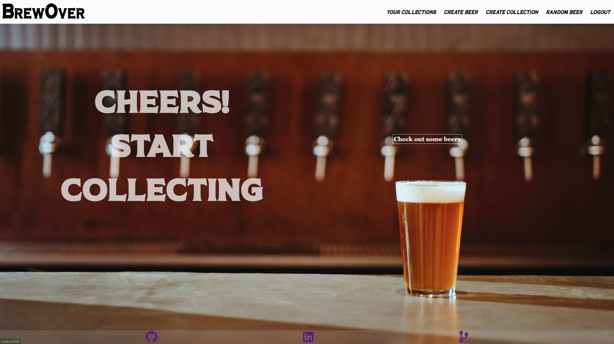

# BrewOver

BrewOver is a web application for sharing and collecting beers with other users. It was inspired by Untappd and built using React.js, Flask, and [punkAPI](https://punkapi.com/).

## Welcome View

## Home View

### Technical Details

The application separates user created drinks and API generated content. I had challenges separating the API data and user created content, and destructuring the API into usable content for my application.

### Features

-   Create Collections of beer
